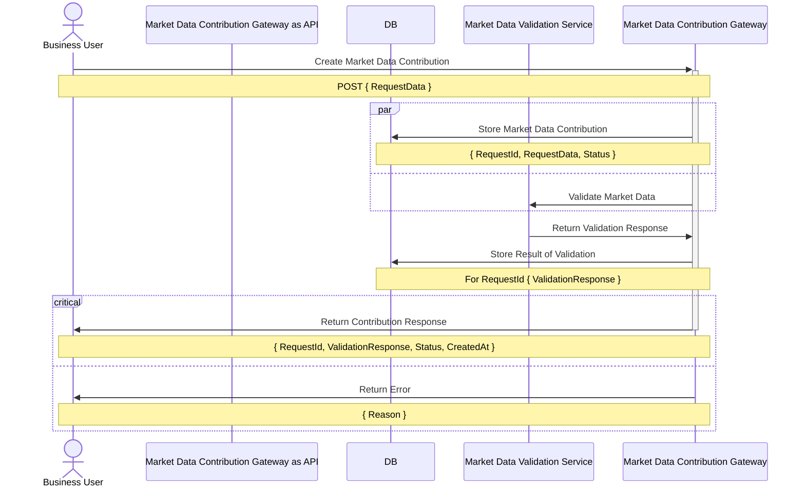
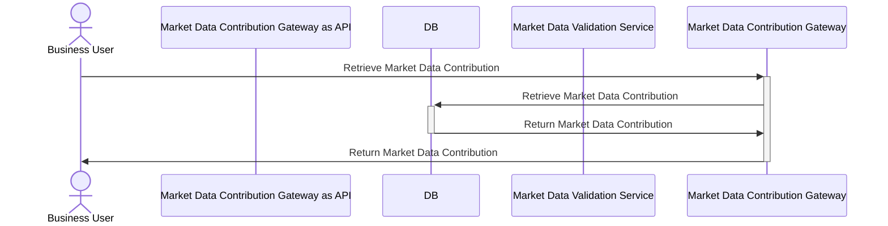

## Creating User Journeys

### Reminder of Requirements

The product requirements for this initial phase are the following:

1. Business users should be able to process a market data contribution through the Market data contribution gateway and
   receive either a successful or unsuccessful response.

2. Business users should be able to retrieve the details of a previously contributed market data. The next section will
   discuss each of these in detail.

## User Journey
### Process a market data contribution

### Retrieve a market data contribution

